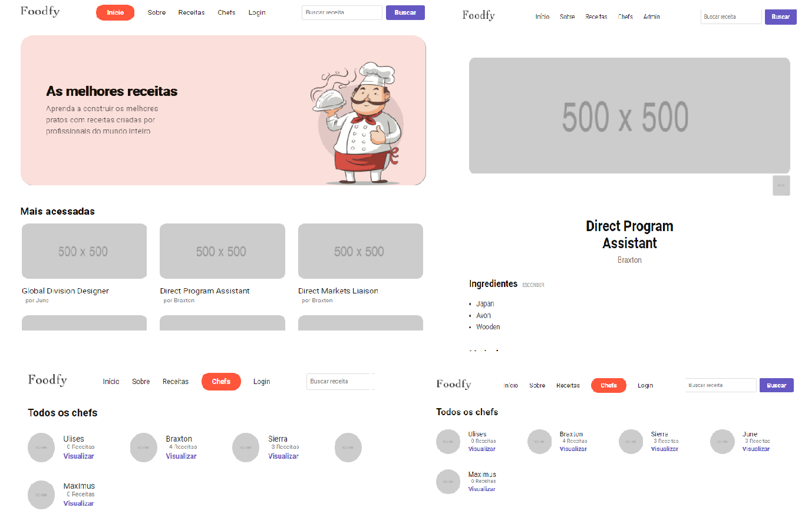
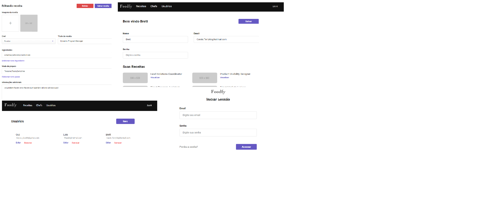
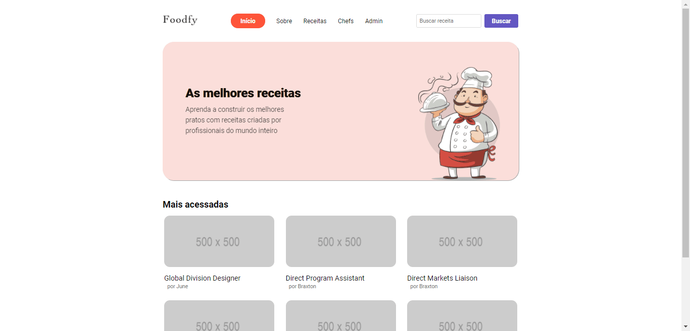
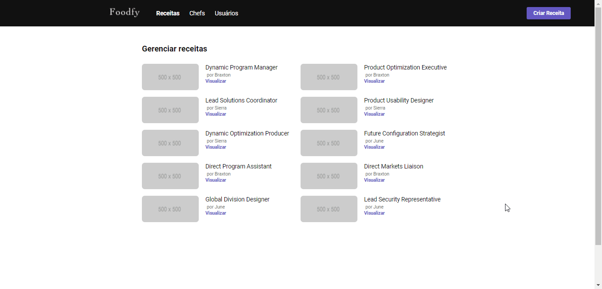
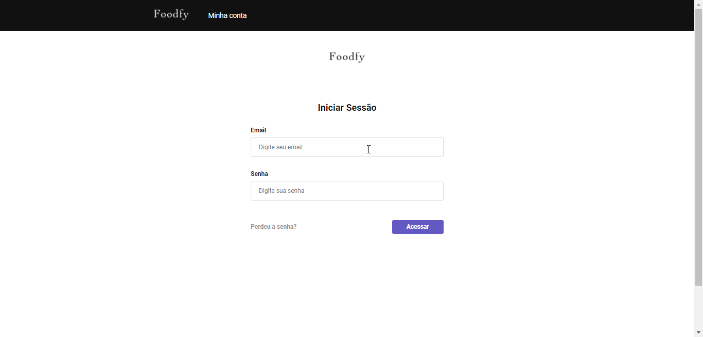

<h1 align="center">
    
</h1>

<h1 align="center">
    
</h1>

<h4 align="center">🏁 Aplicação já finalizada 🏁</h4>
<h2 align="center">

[](https://github.com/pauloreis7/Foodfy/issues)
[](https://github.com/pauloreis7/Foodfy)
[](https://github.com/pauloreis7/Foodfy/commits)
[](https://github.com/pauloreis7/Foodfy/stargazers)
[](https://github.com/pauloreis7/Foodfy/blob/master/LICENSE)
	
</h2>

<p align="center">🍗 Foodfy, aplicação completa sobre receitas 👨‍🍳</p>


## 🔗 Índice
---
 <p>👉 <a href="#sobre">Sobre o projeto</a> </p>
 <p>👉 <a href="#layout">Layout da aplicação</a> </p>
 <p>👉 <a href="#running">Aplicação em funcionamento</a> </p>
 <p>👉 <a href="#func">Funcionalidades</a> </p>
 <p>👉 <a href="#tecs">Tecnologias utilizadas</a> </p>
 <p>👉 <a href="#requests">Pré-requisitos do projeto</a> </p>
 <p>👉 <a href="#work"> Download e execução do projeto</a> </p>
 <p>👉 <a href="#contribuir"> Contribuir com o projeto </a> </p>
 <p>👉 <a href="#autor"> Autor </a> </p>
 <p>👉 <a href="#license"> Licença </a> </p>

<a id="sobre"></a>
## 🔎 Sobre o projeto
---
<p >Aplicação de exibição de receitas compartilhadas por chefs para usuários prepara-las em casa</p>

<a id="layout"></a>
## 🎨 Layout
---



<a id="running"></a>
## 🏎 Aplicação funcionando
---




🚀 Projeto desenvolvido durante o BootCamp LaunchBase da Rocketseat. Uma experiência online com tudo oque um dev iniciante precisa para iniciar no mundo do desenvolimento web com muitos conteúdos prático, desafios e hacks apresentados durante a jornada 🚀

<a id="func"></a>
## ✅ Funcionalidades
---
- [x] Autenticação de usuários
- [x] Envio de email e recuperação de senhas
- [x] Cadastro, atualização e Remoção de usuários e receitas
- [x] Buscas e listagens filtradas
- [x] Sistema de Admin
- [x] Mensagens de alerta ao usuário após cada ação
- [x] Seeds para a aplicação

<a id="tecs"></a>
## 🛠️ Tecnologias
---
💻 Projeto desenvolvido com as seguintes tecnologias

- [JavaScript](https://developer.mozilla.org/en-US/docs/Web/JavaScript)
- [Node.js](https://nodejs.org/en/)
- [Express](https://expressjs.com/pt-br/api.html)
- [nunjucks](https://mozilla.github.io/nunjucks/)
- [PostgresSql](https://www.postgresql.org/)
- [HTML](https://developer.mozilla.org/pt-BR/docs/Web/HTML)
- [CSS](https://devdocs.io/css/)

<a id="requests"></a>
## 🚨 Pré-requisitos do projeto
---
 Antes de começar, você vai precisar ter instalado em sua máquina as seguintes ferramentas:

* [Git](https://git-scm.com)
* [Node.js](https://nodejs.org/en/)

💡 Além disso é bom ter um editor para trabalhar com o código como [VSCode](https://code.visualstudio.com/)

<a id="work"></a>
## 🏄‍♂️ Download e execução do projeto e banco de dados
---

````bash

# Clonar o repositório
$ git clone <https://github.com/pauloreis7/Foodfy>

# Acessar a pasta do projeto terminal/cmd
$ cd Foodfy

# Abrir projeto no VsCode
$ code .

# Intalar as depêndencias do projeto
yarn install

# Banco de dados
No arquivo "database.sql" copie e execute as queries no banco de dados

# Envio de email
Configure o arquivo "src\lib\mail.js" com o banco de dados e o envio email com o mailer

# Adicionar dados para a aplicação
$ Execute o arquivo seed.js para popular seu banco de dados

# Executar a aplicação
$ yarn start

# O servidor inciará na porta:5000 
acesse  <http://localhost:5000>

# Faça login
Faça o login em qualquer conta criada pela seed.js com a senha "123"
````

<a id="contribuir"></a>
## 🎉 Como contribuir para o projeto

[](https://github.com/pauloreis7/Foodfy/pulls)

---

1. Faça um fork do projeto.
2. Crie uma nova branch com as suas alterações: git 3. checkout -b my-feature
4. Salve as alterações e crie uma mensagem de commit contando o que fez: git commit -m "feature: My new feature"
4. Envie as suas alterações: git push origin my-feature


<a id="autor"></a>
## Autor
---

## 👨‍💻 Autor

<a href="https://github.com/pauloreis7">


<b>Paulo Reis</b> 🏆

</a>

<p>Feito por Paulo Reis 🤴 Entre em contato 👋</p>

[](https://www.facebook.com/paulofulano.reis)
[](https://www.instagram.com/paulo_reis.dev/)
[](mailto:paulosilvadosreis2057@gmail.com)

<a id="license"></a>
## 📝 Licença
---
Este projeto esta sobe a licença MIT 🏛️